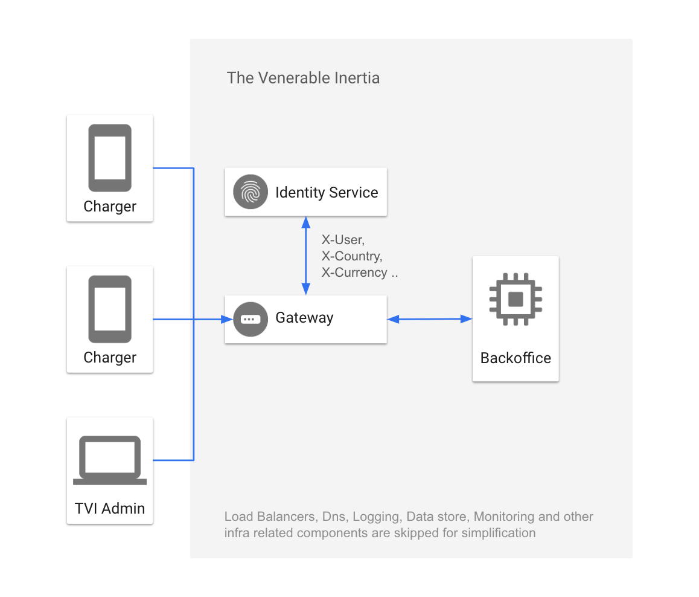

# DependableCharger

DependableCharger is a back-office system for EV Charging Company that computes how much money electric vehicle drivers (aka EV drivers) owe company for their charging sessions.

## Architecture



## Requirements

- Java8 or higher
- Sbt

## Running Service

To bootstrap service run below command on project root. Service will bind to 8080 port for incoming queries.

 ```
$ sbt run
```

## Testing Service

```
$ sbt test
``` 

## Examples Requests

#### Save new tariff

```
$ curl -u tariffuser:password -H "Content-Type: application/json" -X POST -d '{
                                                                                 "energyFee": 2,
                                                                                 "parkingFee": 1,
                                                                                 "serviceFee": 0.1,
                                                                                 "currency": "EUR",
                                                                                 "startDate": "2019-04-10T00:00:00Z"
                                                                               }' http://localhost:8080/tariffs

```

##### Response:
```
{
    "energyFee": 2,
    "parkingFee": 1,
    "serviceFee": 0.1,
    "currency": "EUR",
    "user": "tariffuser",
    "startDate": "2019-04-10T00:00:00Z"
}
```

#### Save new charging session

```
$ curl -H "Content-Type: application/json" -H "X-User: sessionuser" -X POST -d '{
                                                                                  "user":"ismet",
                                                                                  "startDate": "2010-01-01T00:00:00Z",
                                                                                  "endDate": "2010-01-01T01:00:00Z",
                                                                                  "energyConsumed":10
                                                                                }' http://localhost:8080/sessions
   ```

##### Response:

```
{
    "totalChargingCost": 23.1,
    "serviceCost": 2.1,
    "session": {
        "user": "sessionuser",
        "startDate": "2010-01-01T00:00:00Z",
        "endDate": "2010-01-01T01:00:00Z",
        "energyConsumed": 10
    },
    "currency": "EUR",
    "tariff": {
        "serviceFee": 0.1,
        "parkingFee": 1,
        "currency": "EUR",
        "energyFee": 2,
        "user": "tariffuser",
        "startDate": "2019-04-10T00:00:00Z"
    },
    "parkingCost": 1,
    "energyCost": 20
}
```

#### Export user billing report as csv

```
$ curl -H "X-User: sessionuser" http://localhost:8080/sessions
```

##### Response:

```
currency, tariff  energy  fee , tariff  parking  fee , tariff  service  fee , session  start  date , session  end  date , session  energy  consumed , energy  cost , parking  cost , service  cost , total  cost  to  pay 
EUR,2,1,0.1,2010-01-01T00:00:00Z,2010-01-01T01:00:00Z,10.0,20.00,1.00,2.10,23.10
```


